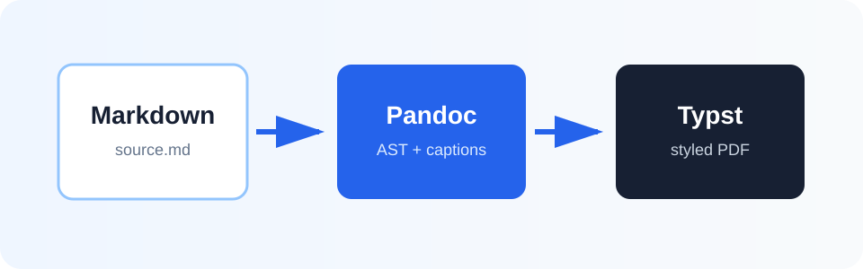

# Überblick

Dieses Dokument demonstriert eine vollständig automatische Publikationsstrecke. Die Application Programming Interface (API) verbindet dabei Analyse und Rendering, ohne zusätzliche Markierungen für Verzeichnisse zu verlangen.

Typst
: Ein programmierbares Satzsystem für hochwertige Dokumente.

**Renderer**: Die Komponente, die aus dem erzeugten Typst-Dokument eine PDF-Datei baut.

> Gute Dokumentation macht Struktur sichtbar, ohne den Lesefluss zu unterbrechen.

## Pipeline

Die Verarbeitung besitzt drei klar getrennte Phasen:

1. Pandoc liest Markdown in einen strukturierten Syntaxbaum ein.
2. Der Filter ergänzt fehlende Beschriftungen aus dem Dokumentkontext.
3. Typst setzt Inhalt, Verzeichnisse und bei Bedarf das Glossar als PDF.

| Phase | Eingabe | Ausgabe | Verantwortung |
| --- | --- | --- | --- |
| Analyse | Markdown | Pandoc AST | Struktur erkennen |
| Transformation | Pandoc AST | Typst | Beschriftungen ergänzen |
| Satz | Typst | PDF | Layout und Typografie |

## Architektur



Die Abbildung wird aus normalem Markdown erkannt. Ihr Alternativtext dient als aussagekräftige Beschriftung für das Abbildungsverzeichnis.

# Gestaltung

Das Preset `modern` nutzt eine ruhige blaue Akzentfarbe, kompakte Tabellen und kontrastreiche Codeblöcke. `academic` setzt stärker auf Serifenschriften und klassische Regeln. `minimal` reduziert Dekoration und Einzüge.

## Codeblöcke

```python
def publish(markdown, output):
    """Render one source document deterministically."""
    ast = pandoc.read(markdown)
    typst = transform(ast)
    return compile_pdf(typst, output)
```

Inline-Code wie `--glossary glossary.yml` bleibt auch in langen Absätzen gut lesbar. Links wie [Typst](https://typst.app/) übernehmen die Akzentfarbe des Presets.

## Zweite Datensicht

| Schalter | Standard | Wirkung |
| --- | --- | --- |
| `--no-toc` | aus | Inhaltsverzeichnis unterdrücken |
| `--no-tot` | aus | Tabellenverzeichnis unterdrücken |
| `--no-tof` | aus | Abbildungsverzeichnis unterdrücken |
| `--glossary glossary.yml` | nicht gesetzt | Glossar aus YAML-Datei ergänzen |

# Qualitätssicherung

Die visuelle Prüfung betrachtet Titelseite, automatische Verzeichnisse, Tabellen, Abbildungen, Codeblöcke und - falls angefordert - das Glossar. Zusätzlich wird der PDF-Text extrahiert, damit alle automatisch erzeugten Überschriften nachweisbar sind.

## Abnahmekriterien

- Keine abgeschnittenen Zeilen oder überlappenden Elemente.
- Lesbare Seitenzahlen und konsistente Abschnittshierarchie.
- Einträge für beide Tabellen und die Abbildung.
- Mit `--glossary glossary.yml` passende Glossareinträge für API und Typst.
- Reproduzierbarer Build ohne Python-Abhängigkeiten außerhalb der Standardbibliothek.
